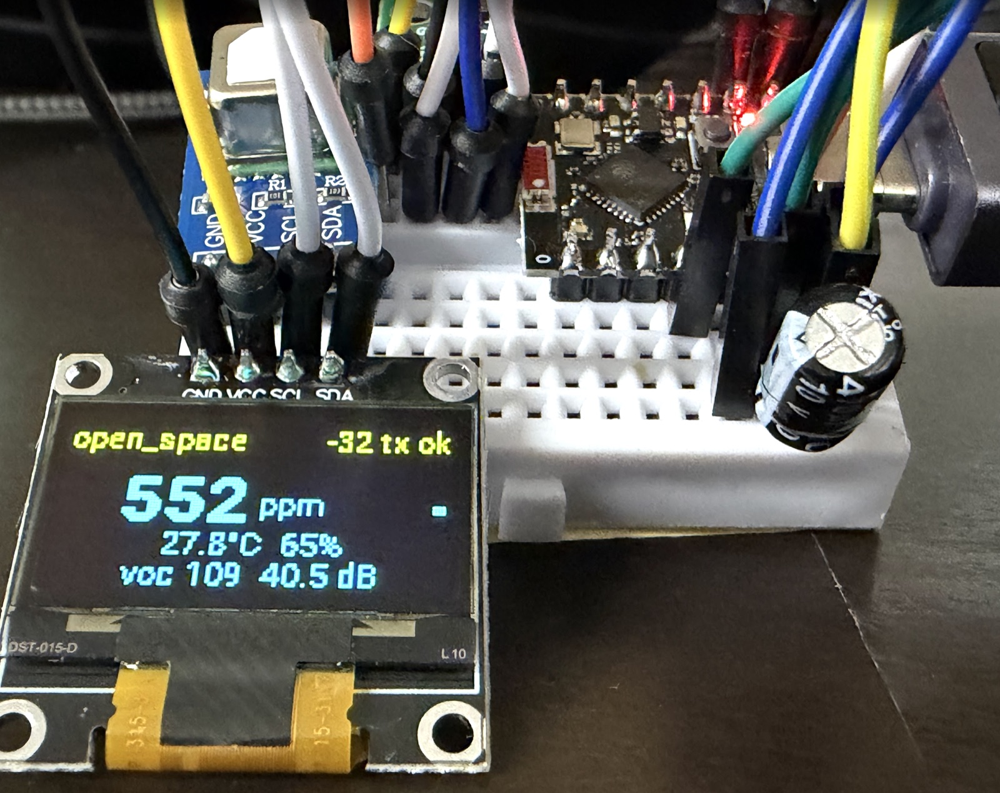
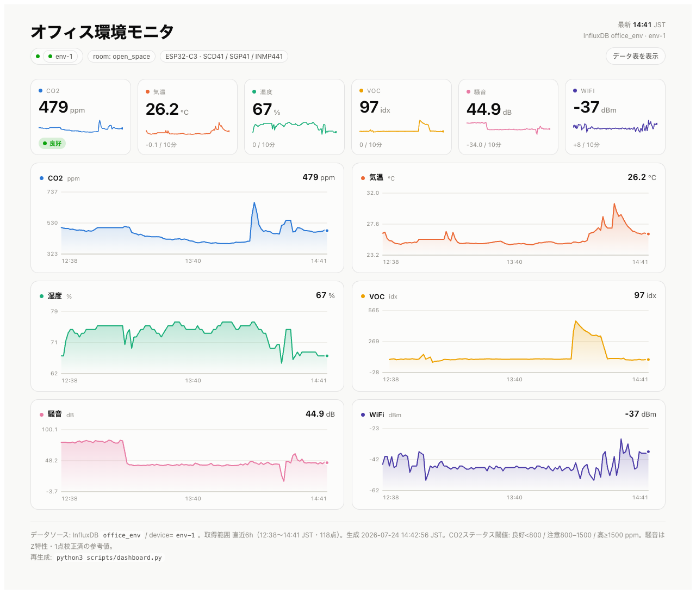

# office-env — オフィス環境モニタ

ESP32-C3 + ESPHome によるオフィス環境モニタ。CO2・温度・湿度・VOC・NOx・騒音を計測し、毎分 InfluxDB へ送信する。手元に現在値を表示する OLED 付き。3台同構成で運用する前提。



## 計測項目

| 項目 | センサ | 単位 |
|------|--------|------|
| CO2 | SCD41 | ppm |
| 温度 / 湿度 | SCD41 | ℃ / % |
| VOC Index / NOx Index | SGP41 | index |
| 騒音（Z特性RMS音圧, 1点校正済） | INMP441 | dB |
| WiFi RSSI | ESP32-C3 | dBm |
| MCU温度（チップ内蔵・発熱監視用） | ESP32-C3 | ℃ |

詳細設計（アーキテクチャ・BOM・回路・データ契約・設置・実戦トラブルシュート）は [`docs/design.md`](docs/design.md) を参照。

## 構成ファイル

ESPHome 設定・秘匿値は `config/` に集約している。

| ファイル | 役割 |
|---------|------|
| `config/office-env-base.yaml` | 3台共通のベース設定（センサ・表示・送信ロジック） |
| `config/env-1.yaml` / `config/env-2.yaml` / `config/env-3.yaml` | 個体別ラッパー。`substitutions` 3行（device_name/friendly_name/room）だけ差分 |
| `config/secrets.yaml` | WiFi / OTA / InfluxDB の秘匿値（**コミットしない**。`.gitignore` 済） |
| `config/secrets.yaml.example` | secrets のサンプル（実値なし） |

個体を増やす場合は `config/env-1.yaml` をコピーし、`device_name` / `friendly_name` / `room` の3つを変更するだけ。

## セットアップ

### 1. 前提

- Python + [ESPHome](https://esphome.io/)（最新版。`sound_level` コンポーネントを使うため）
- ESP32-C3 を USB-C で接続

```bash
pip install esphome        # もしくは pipx / docker
esphome version            # 動作確認
```

### 2. secrets を用意

```bash
cp config/secrets.yaml.example config/secrets.yaml
# config/secrets.yaml を編集して各値を埋める
```

### 3. ビルド & 書き込み

```bash
# USBシリアルポートを確認（macOSの例）
ls /dev/cu.usbmodem*

esphome run config/env-1.yaml --device /dev/cu.usbmodem2101
```

- 初回は USB 経由、以降は OTA（無線）で更新可能。
- 起動ログの I2C scan に `0x3C` `0x59` `0x62` が並べば配線OK。

### 4. 動作確認

WiFi 接続後、60秒ごとに InfluxDB へ書き込む。OLED 右上に `tx ok` が出れば送信成功。

## データの確認（InfluxDB）

InfluxDB Cloud (v2) の Data Explorer、または API で確認する。

```bash
curl -s 'https://<region>.aws.cloud2.influxdata.com/api/v2/query?org=<ORG_ID>' \
  -H "Authorization: Token <READ_TOKEN>" \
  -H 'Content-Type: application/vnd.flux' \
  -H 'Accept: application/csv' \
  --data 'from(bucket:"office_env") |> range(start:-15m)
          |> filter(fn:(r)=> r.device=="env-1") |> tail(n:20)'
```

- measurement: `env` / tags: `room`, `device` / fields: `co2` `temp` `rh` `voc` `nox` `laeq` `lamax` `rssi` `mcu_temp`
- 常設ダッシュボードは Grafana を推奨。

## ローカルダッシュボード

InfluxDB から最新データを取得して、単一HTMLダッシュボードを生成・プレビューするスクリプト。依存なし（Python標準ライブラリのみ）。認証情報は `secrets.yaml` から自動で読む。

```bash
python3 scripts/dashboard.py                 # env-1・直近6h を生成してブラウザで開く
python3 scripts/dashboard.py --device env-2  # 別の個体
python3 scripts/dashboard.py --range 24h     # 期間指定（3h / 24h / 7d ...）
python3 scripts/dashboard.py --no-open       # 生成のみ（開かない）
```

出力は `dist/dashboard.html`（`.gitignore` 済）。CO2・気温・湿度・VOC・騒音・WiFi・MCU温度 の現在値タイルとトレンド、ホバーでツールチップ、データ表トグル付き。ライト/ダーク両対応。



認証情報を環境変数で上書きする場合:

```bash
INFLUX_QUERY_URL='https://<region>.aws.cloud2.influxdata.com/api/v2/query?org=<ORG_ID>' \
INFLUX_TOKEN='<TOKEN>' python3 scripts/dashboard.py
```

## 校正

- **騒音**: 設置場所でスマホ騒音計と1点校正する。`config/office-env-base.yaml` の `sound_level` → `offset` を調整。
  `新offset = 現offset + (基準計の値 − 現在の表示値)`
- **温度**: `temperature_offset`（既定4.0）を室温計と比較して調整。

詳細は [`docs/design.md`](docs/design.md) の「校正」参照。

## トラブルシューティング

| 症状 | 対処 |
|------|------|
| `Probe Request Unsuccessful` で接続失敗を繰り返す | C3 SuperMini のブラウンアウト。`wifi` → `output_power: 8.5dB` を設定済み。まだ不安定なら 8.5→7dB 等さらに下げる |
| WiFi に繋がらない | SSID が 2.4GHz か確認（C3 は 5GHz 非対応） |
| 騒音値が高すぎ／平坦 | 未校正。上記「校正」を実施。中身は Z特性のため dBA より高く出る |
| マイクが無音 | INMP441 の L/R 結線の個体差。`channel: left` → `right` に変更 |
| OLED に何も出ない | I2C scan に `0x3C` が出るか確認。20–9時は焼き付き対策で消灯する仕様 |
| OTA（無線更新）が `env-N.local` を解決できない | 共有APのクライアント分離 or 別ネット。固定IP/DHCP予約して `esphome run config/env-N.yaml --device <IP>` で直接指定。`config/office-env-base.yaml` の `manual_ip` コメントブロックも参照。分離環境ではUSB書き込み |

## InfluxDB ダッシュボード（device 横断・多系列）

環境メトリック（co2 / temp / rh / voc / laeq）を device 別の多系列で表示する
InfluxDB Cloud ダッシュボードを、テンプレートから適用する。

- テンプレート定義: `influx/dashboard-office-env.json`
- 適用スクリプト: `scripts/apply_dashboard.py`（Python 標準ライブラリのみ）

device 固定フィルタを置かず `group(columns:["device"])` で系列化するため、
env-2 / env-3 を投入すると系列が自動で増える。粒度は `v.windowPeriod` により
UI の時間レンジ・ズームに追従する。

### 準備

`config/secrets.yaml` にダッシュボード読み書き権限のトークンを設定する（環境変数
`INFLUX_DASHBOARD_TOKEN` でも可）。

```
influx_dashboard_token: "<token>"
```

### 適用

```sh
# 検証のみ（作成しない）。まず必ずこれで確認する
python3 scripts/apply_dashboard.py --dry-run

# 本適用（実ダッシュボード作成）
python3 scripts/apply_dashboard.py

# 既存スタックを更新（重複生成を避ける）
python3 scripts/apply_dashboard.py --stack-id <STACK_ID>
```

## 死活監視

各デバイスが直近にデータを送っているかを InfluxDB で確認し、一定時間途絶したら検出する。依存なし（Python標準ライブラリ）。認証は dashboard.py と同じ（`influx_read_token` / 環境変数）。

```bash
python3 scripts/liveness_check.py                       # env-1..3 を5分閾値で確認
python3 scripts/liveness_check.py --max-age 10          # 閾値10分
python3 scripts/liveness_check.py --webhook <Slack URL> # 異常時にSlack通知
```

問題があれば終了コード1。cron で定期実行（例: `*/5 * * * * python3 .../scripts/liveness_check.py --webhook ...`）。InfluxDB ネイティブの deadman check を使う手もある。

