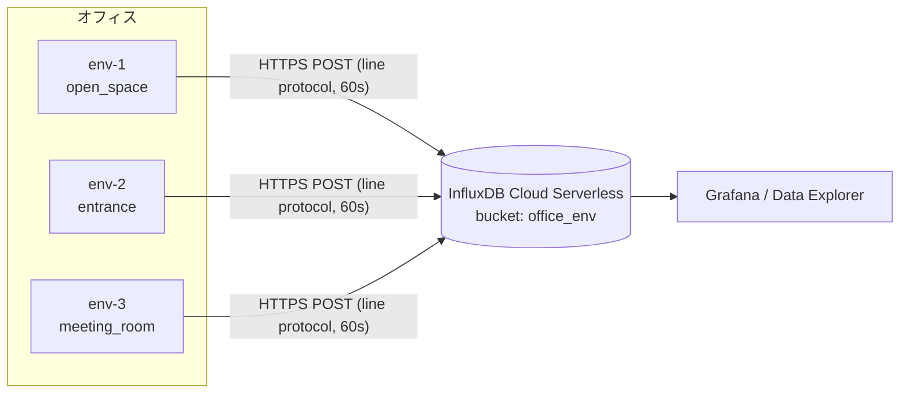
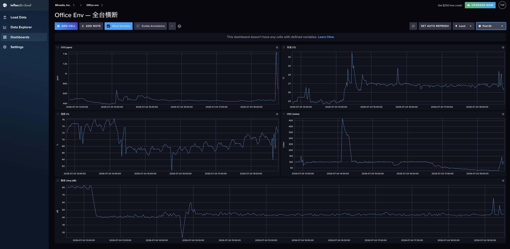

# office-env — 詳細設計書

Minedia青山オフィスの執務環境（CO2・温度・湿度・におい・騒音）を3拠点で常時計測し、
InfluxDB Cloudに集約して可視化する自作センサノード。

- ハード: ESP32-C3 + Sensirionセンサ群、1台あたり約¥6,300
- ファーム: ESPHome（カスタムコードなし、YAMLのみ）
- データ: 毎分1点 × 9フィールド × 3台 → InfluxDB Cloud Serverless

## アーキテクチャ



デバイスは外向きHTTPSのみ（インバウンド不要・HA不要）。Home Assistantには依存しない。
計測終了後に自宅へ持ち帰れば、同一ファームのままnative APIで自宅HAに登録可能。

## BOM（3台分）

| 部品 | 型番/仕様 | 数量 | 役割 |
|---|---|---|---|
| MCU | ESP32-C3 SuperMini Plus | 3 (+予備2) | WiFi 2.4GHz / I2C / I2S |
| CO2・温湿度 | Sensirion SCD41（TENSTARモジュール） | 3 | フォトアコースティックNDIR、±(40ppm+5%) |
| におい | Sensirion SGP41（GY-SGP41） | 3 | VOC/NOx指数（相対値、100=ベースライン） |
| 騒音 | INMP441 | 3 (+予備2) | I2S MEMSマイク、端末内でdB化 |
| 表示 | SSD1306 0.96″ OLED 128×64 | 3 (+予備2) | 黄/青2色分割パネル（後述） |
| 電源安定化 | 電解コンデンサ 470µF/10V | 3 | 3.3Vレールのバースト吸収 |
| 電源 | USB-A充電器 5V/1A + A-to-Cケーブル | 3 | **データ通信対応ケーブル必須**（書き込み時） |
| ケース | ダイソーPP深型（内寸目安70×50×35mm） | 3 | 通気穴・音孔・OLED窓を加工 |

注意点:
- eCO2系センサ（SGP41含む）のCO2値は使用しない。実CO2はSCD41のみ
- SCD41センサ上面の白い四角はPTFE通気膜。**剥がすと死ぬ**
- SuperMiniクローンはUSB CC抵抗欠品個体があるため、C-to-C給電は不可。A-to-C統一

## 回路

配線図の正本は [`docs/office_env_monitor_schematic_v3.svg`](office_env_monitor_schematic_v3.svg)。要約:

```
USB-C 5V ──► [ESP32-C3 SuperMini Plus]  (オンボードLDO → 3.3V)
              ├─ 3V3 ────┬─ SCD41.VDD ─┬─ SGP41.VIN ─┬─ OLED.VCC ─┬─ INMP441.VDD ─┬─ C1(+)
              ├─ GND ────┴─────────────┴─ 全デバイス共通 ──────────┴───────────────┴─ C1(−)
              ├─ GPIO6 ── SDA: SCD41 / SGP41 / OLED     (I2C 100kHz)
              ├─ GPIO7 ── SCL: SCD41 / SGP41 / OLED
              ├─ GPIO4 ── INMP441.SCK (=BCLK)           (I2S)
              ├─ GPIO5 ── INMP441.WS
              └─ GPIO3 ── INMP441.SD
                          INMP441.L/R → GND（左ch固定）
```

| 項目 | 値 | 備考 |
|---|---|---|
| I2Cアドレス | 0x3C / 0x59 / 0x62 | OLED / SGP41 / SCD41。起動ログのscanで3つ揃えば配線OK |
| I2Cクロック | 100kHz | SCD41の上限 |
| 未使用ピン | GPIO8, GPIO9 | LED(WS2812)/BOOT兼ストラッピング。**使わない** |
| C1 | 470µF/10V | SCD41のVDD直近。WiFi TXバースト+SCD41測定パルスの同時ピーク対策 |
| 給電 | 全デバイス3.3V統一 | ESP32-C3は5V非トレラント。5Vピンはどこにも繋がない |
| モジュール結線 | シルクの信号名で合わせる | ピン並びはロットで異なる（GND-VCC-SCL-SDA順とは限らない） |

> 補足（実機立ち上げで追加）: C3 SuperMiniクローンは WiFi 送信時の電流スパイクでブラウンアウトし
> `Probe Request Unsuccessful` を出しやすい。ファームで送信出力を下げている（`wifi: output_power: 8.5dB`）。
> C1(470µF) と併せて電源系の安定化策。

## ファームウェア（ESPHome）

```
office-env/
├── config/
│   ├── office-env-base.yaml   # 共通ロジック（センサ・OLED・Influx POST）
│   ├── env-1.yaml             # 個体ラッパー: device_name / room だけ定義
│   ├── env-2.yaml
│   ├── env-3.yaml
│   ├── secrets.yaml.example
│   └── secrets.yaml           # gitignore対象。WiFi・Influxトークン
└── docs/
    └── office_env_monitor_schematic_v3.svg
```

初回書き込み（USB。以後はOTA）:

```sh
brew install esphome
cp config/secrets.yaml.example config/secrets.yaml && vim config/secrets.yaml
esphome run config/env-1.yaml   # ポートは /dev/cu.usbmodem*
```

設計上のポイント:

- `api: reboot_timeout: 0s` — HA未接続運用の必須設定。無いと15分毎に再起動する
- SGP41のVOC/NOx指数はSCD41の温湿度を補償入力に使用（`compensation:`）
- 騒音は公式`sound_level`のRMS(dBFS)+オフセットでdB SPL近似。周波数重みなし(Z特性相当)。
  A特性が必要になったら stas-sl/esphome-sound-level-meter に騒音部のみ差し替え可
- OLEDは黄(上16px)/青(下48px)の2色分割パネル前提のゾーンレイアウト。
  黄色帯=部屋名+電波/送信状態、CO2≥1500ppmで警告バナー化。白単色パネルでも同一レイアウトで成立
- CO2≥1000ppmでCO2数字を2s周期で白黒反転（注意喚起）。点滅は数字が消えるフレームができるため反転に変更した。
  反転帯は数字+ppmのみ（x0-85 / y16-39）で、スパークラインと温湿度行には掛からない
- CO2閾値は `substitutions` の `co2_high`(1500) / `co2_blink`(1000) に集約。ダッシュボードJSの閾値とも揃える
- 焼き付き対策: コントラスト40% / 20–9時消灯 / 5分毎1pxシフト（色境界は跨がない）
- WiFi: `output_power: 8.5dB`（ブラウンアウト対策）+ `fast_connect: true`（スキャン省略で直結）。
  OTAはmDNS(`env-N.local`)。共有APのクライアント分離等で解決できない場合は `manual_ip`（コメントで雛形あり）で固定IP化し `--device <IP>` 指定

## データ契約（InfluxDB）

- 送信先: `POST https://<REGION>.aws.cloud2.influxdata.com/api/v2/write?org=<ORG_ID>&bucket=office_env&precision=s`
- 認証: `Authorization: Token <write専用トークン>`（bucket write権限のみ。secrets.yamlで管理）
- 頻度: 60秒ごとに1行

```
env,room=<部屋名>,device=<個体名> co2=675i,temp=25.90,rh=71.0,voc=108i,nox=1i,laeq=38.1,lamax=55.0,rssi=-45i,mcu_temp=48.9
```

| field | 型 | 内容 |
|---|---|---|
| co2 | int | ppm（SCD41実測） |
| temp / rh | float | °C / %RH（SCD41、オフセット補正後） |
| voc / nox | int | Sensirion指数 1–500（100=直近24hベースライン、相対値） |
| laeq / lamax | float | 1分平均 / 1分最大 dB（校正後） |
| rssi | int | WiFi RSSI dBm（設置サーベイ・死活監視用） |
| mcu_temp | float | ESP32-C3チップ内蔵温度センサの接合部温度°C（発熱監視用。**室温ではない**） |

tag値は英小文字スネークケースのみ（例: `open_space`）。日本語・スペース禁止。

> 命名の注記: `laeq`/`lamax` は歴史的経緯の命名。中身はZ特性のため計測学的には `lzeq`/`lzmax` が正しいが、
> 既存データとの連続性のため据え置き。

> 起動直後の注意: VOC/NOx（SGP41）は起動直後は送信されず、グラフに値が出るまで1〜2分・信頼できる相対値になるまで初回約1時間かかる（`store_baseline: true` で再起動時は短縮）。

## ダッシュボード（device横断・多系列）

送信している9フィールド全て（co2 / temp / rh / voc / nox / laeq / lamax / rssi / mcu_temp）を device 別の多系列で表示する InfluxDB Cloud ダッシュボード（1フィールド=1セル）。`influx/dashboard-office-env.json`（テンプレート）を `scripts/apply_dashboard.py` で適用する。device 固定フィルタを置かず `group(columns:["device"])` で系列化するため、env-2 / env-3 を投入すると系列が自動で増える。粒度は `v.windowPeriod` で時間レンジ・ズームに追従する。



適用手順は [`README.md`](../README.md) の「InfluxDB ダッシュボード」を参照。

## 校正

| 対象 | 方法 | タイミング |
|---|---|---|
| 騒音オフセット | スマホ騒音計と並べ、`新offset = 現offset + (基準計 − 表示)` を `sound_level` の `offset:` に反映（env-1は校正済 81.1） | 設置時に各台1回 |
| 温度オフセット | ケース組込後、独立温度計と比較して`temperature_offset:`調整（既定4.0） | ケース組込後 |
| CO2 | 自動較正(ASC)有効のまま。夜間無人+換気で外気ベースラインが取れる前提 | 不要（自動） |
| VOC/NOx | 24hで自動ベースライン学習。起動直後数分〜数時間は参考値 | 不要（自動） |

騒音の傾きは物理的に1:1のため、オフセットのみ校正すれば足りる。

## 設置ガイドライン

床上1.1–1.5m / 給気口直下・窓の直射・人の呼気直撃を避ける / マイク音孔をケース穴(φ1.5–2mm)に位置合わせ /
夜間に落とされない常時給電コンセント / 設置時にOLED黄色帯のRSSIで電波確認（-70dBmより弱い場所は避ける）

## トラブルシューティング（実戦記録）

| 症状 | 原因 | 対処 |
|---|---|---|
| 全APで`Probe Request Unsuccessful`/`Auth Expired`連発 | フラッシュ内RF較正データの破損 | `python3 -m esptool --chip esp32c3 erase_flash` → 焼き直し。**通常の書き込みではNVSが温存されるため直らない** |
| 初回USB書き込みが始まらない | ダウンロードモード未突入 | BOOT押しながらRST→BOOT放す |
| dBが異常値張り付き/無音 | INMP441クローンのch逆転個体 | `channel: left` ⇄ `right` |
| センサ値がnanのまま | I2C接触不良。**挿し直しただけでは復帰しない** | 配線確認→RST（ESPHomeは起動時にのみデバイス検出） |
| 書き込めない/給電されない | 充電専用ケーブル or C-to-C | データ対応A-to-Cケーブルを使う |
| 15分毎に再起動 | `api:`のreboot_timeout既定値 | `reboot_timeout: 0s`（設定済み） |

## 運用メモ

- 消費電力（実測）: 5.06V × 0.118A ≒ **0.60W/台**（WiFi常時・全センサ稼働時）。
  = 0.43 kWh/月・5.2 kWh/年（3台で 1.29 kWh/月）。電気代は単価31円/kWh仮定で約13円/月・台（3台で約40円/月）。ほぼ無視できる
- 計測方針: 3部屋固定で1ヶ月連続計測（途中で動かすと週次比較が濁る）。4部屋目は2ヶ月目に移設で対応
- プライバシー: 音声波形は端末内で即時レベル値化して破棄。端末外に出るのは数値のみ（技術的に録音不可能な構成）。社内告知1行を推奨
- InfluxDB無料枠は保持30日。長期保持は従量プラン（$250クレジット付与、本ワークロードの実費は月数十円）
- Grafana常時表示する場合はリフレッシュ5分推奨（従量プランはクエリ回数課金のため）
