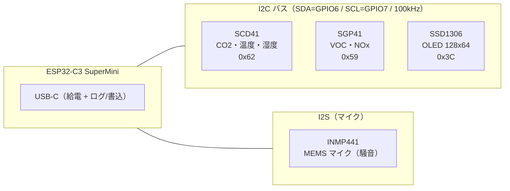

# 基板・センサ設計書（office-env）

オフィス環境モニタのハードウェア設計。ESP32-C3 を中心に I2C センサ群 + I2S マイク + OLED を接続する。

> **注記**: 本書は正式な回路図（KiCad 等）ではなく、ファームウェア設定 `office-env-base.yaml` のピン定義とコメント（「回路図v3対応」）から再構成した設計書。実配線と差異があれば `office-env-base.yaml` が正。

## 1. 構成概要

## 2. 部品表（BOM）

| 部品 | 型番 / 種別 | 役割 | I/F |
|------|------------|------|-----|
| MCU | ESP32-C3 SuperMini | 制御・WiFi・InfluxDB送信 | — |
| CO2/温湿度 | SCD41（光音響NDIR） | CO2 / 温度 / 湿度 | I2C |
| ガス | SGP41（MOX） | VOC Index / NOx Index | I2C |
| マイク | INMP441（I2S MEMS） | 騒音（RMS音圧レベル） | I2S |
| 表示 | SSD1306 0.96" 128x64（2色: 黄/青） | 現在値表示 | I2C |
| 給電 | USB-C 5V | 電源・書込・ログ | — |

- INMP441 モジュール: [AliExpress 商品ページ](https://ja.aliexpress.com/item/1005006740892303.html)
- SSD1306 は白単色パネルでも同一レイアウトで動作する（2色パネル前提の配色だが破綻しない）。

## 3. ピンアサイン

### I2C バス（GPIO6 / GPIO7, 100kHz）

SCD41 の上限が 100kHz のためバス全体を 100kHz に固定。3デバイスを同一バスにぶら下げる。

| 信号 | ESP32-C3 | 接続先 |
|------|----------|--------|
| SDA | GPIO6 | SCD41 / SGP41 / SSD1306 の SDA |
| SCL | GPIO7 | SCD41 / SGP41 / SSD1306 の SCL |
| VCC | 3V3 | 各モジュール VCC |
| GND | GND | 各モジュール GND |

起動ログの I2C scan に `0x3C` `0x59` `0x62` が並べば配線OK。

### I2S マイク（INMP441）

| 信号 | ESP32-C3 | INMP441 ピン | 備考 |
|------|----------|-------------|------|
| BCLK（SCK） | GPIO4 | SCK | ビットクロック |
| LRCLK（WS） | GPIO5 | WS | ワードセレクト |
| DIN（SD） | GPIO3 | SD | データ入力 |
| VCC | 3V3 | VDD | |
| GND | GND | GND / L/R | **L/R を GND** に落とすと左chになる |

- ファームは `channel: left`（L/R→GND=左ch前提）。無音の場合は基板の個体差で逆のことがあるため `channel: right` に変更する。
- サンプル: 16kHz / 32bit / 外部ADC（`adc_type: external`, `pdm: false`）。

## 4. I2C アドレスマップ

| アドレス | デバイス |
|---------|---------|
| 0x3C | SSD1306 OLED |
| 0x59 | SGP41 |
| 0x62 | SCD41 |

## 5. OLED 表示レイアウト（128x64）

2色パネル（上16px=黄 / 下48px=青）を前提にした配置。焼き付き対策として、深夜(23–6時)消灯・5分ごと1pxシフトを実装。

| 領域 | y | 内容 |
|------|---|------|
| 黄帯 | 0–15 | 左=部屋名 / 右=RSSI + 送信状態(`tx ok`/`tx --`)。CO2≥1500ppmで `CO2 HIGH` バナーに変化 |
| 青帯（大） | 16– | CO2 値（大font）+ 単位 ppm（小font） |
| 青帯 | 40 | 温度℃ / 湿度% |
| 青帯 | 51 | VOC / 騒音dB |

## 6. 電源

- USB-C 5V 給電。ESP32-C3 のLDOで 3V3 生成、センサ・OLED は 3V3 駆動。
- **注意（C3 SuperMini）**: 安価な基板は WiFi 送信時の電流スパイクでブラウンアウトし、`Probe Request Unsuccessful` で接続に失敗しやすい。対策として WiFi 送信出力を下げている（`output_power: 8.5dB`）。

## 7. センサ校正メモ

- **SCD41 温度オフセット**: `temperature_offset: 4.0`。ケース組込後の自己発熱ぶんを引く。設置後にスマホ/室温計と比較して調整。
- **SCD41 CO2 自己校正**: `automatic_self_calibration: true`（ASC。定期的に外気≒400ppmを基準に補正）。
- **SGP41 補償**: SCD41 の温湿度で VOC/NOx を補償（`store_baseline: true`）。
- **騒音（INMP441）**: `sound_level` は Z特性（周波数重み無し）RMS を dBFS で出力し、`offset` で dB SPL 近似に変換。1点校正済み（`offset: 81.1`, open_space, スマホ 41.3dBA 基準）。
  - 傾きは物理的に 1:1 のためオフセットのみ校正すれば足りる。
  - 厳密な A特性(dBA) が必要な場合は `stas-sl/esphome-sound-level-meter` への差し替えを検討。

## 8. 既知の注意点

- ESP32-C3 は **2.4GHz のみ**。5GHz/6GHz SSID には接続不可。
- `sound_level` は比較的新しい公式コンポーネント。ESPHome を最新にしてビルドする。
- InfluxDB のフィールド名 `laeq`/`lamax` は歴史的経緯の命名。中身は Z特性のため計測学的には `lzeq`/`lzmax` が正しい（変更すると既存データと不連続になるため据え置き）。
